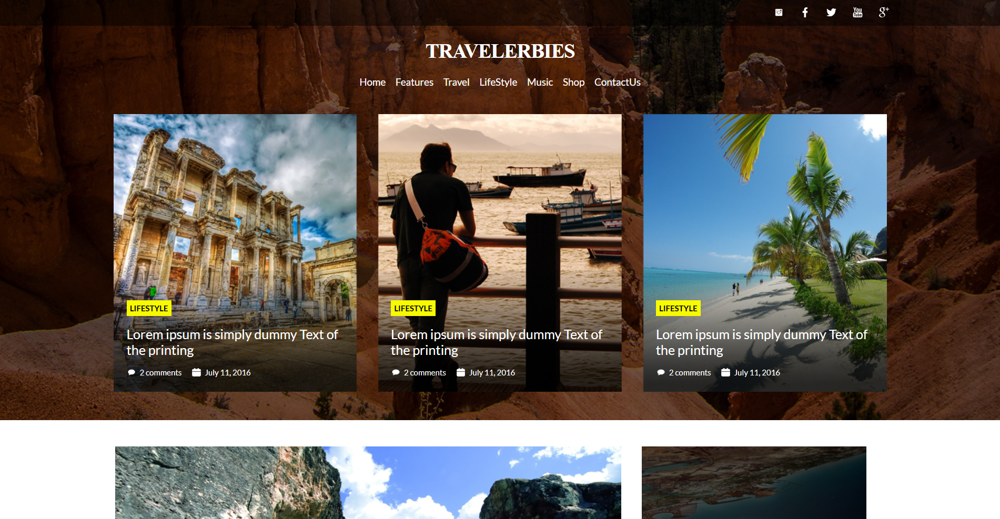

# TravelerBies

A modern, responsive travel blog and lifestyle platform built with React.



## Overview

TravelerBies is a feature-rich travel blog and lifestyle platform designed to showcase travel destinations, experiences, and lifestyle content. Built with React and Vite, this project demonstrates modern front-end development practices with a component-based architecture.

## Features

-   **Responsive Design**: Optimized for all devices from mobile to desktop
-   **Multi-page Layout**:
    -   Home page with featured content
    -   Travel destinations
    -   Lifestyle articles
    -   Music content
    -   Shop integration
    -   Contact page
-   **Social Media Integration**: Connect with Instagram, Facebook, Twitter, YouTube, and Google
-   **Content Categories**:
    -   Latest posts
    -   Most popular articles
    -   Featured highlights
    -   Gallery showcase
-   **Interactive Elements**:
    -   Card-based content presentation
    -   Comment system
    -   Date tracking for posts

## Tech Stack

-   **React**: Front-end library for building the user interface
-   **Vite**: Next-generation frontend tooling for faster development
-   **CSS3**: Custom styling with dedicated CSS files per component
-   **JSX**: Component-based structure for reusable UI elements

## Project Structure

```
TravelerBies/
├── src/
│   ├── assets/          # Images and icons organized by section
│   ├── Cards/           # Reusable card components for different content types
│   ├── Components/      # Core components with data logic
│   ├── CSS/             # Styling for each page and component
│   ├── Pages/           # Main page layouts (Header, Footer, Content pages)
│   ├── App.jsx          # Main application component
│   └── main.jsx         # Entry point
└── public/              # Static assets
```

## Getting Started

### Prerequisites

-   Node.js (v14.0.0 or later)
-   npm or yarn

### Installation

1. Clone the repository

    ```
    git clone https://github.com/yourusername/TravelerBies.git
    ```

2. Install dependencies

    ```
    cd TravelerBies
    npm install
    ```

3. Start the development server

    ```
    npm run dev
    ```

4. Open your browser to `http://localhost:5173`

## Build for Production

```
npm run build
```

## Design Philosophy

TravelerBies embraces a clean, content-focused design that puts the traveler's experience at the forefront. The card-based layout allows for easy content browsing, while the categorized sections help users discover new destinations and lifestyle content efficiently.

## Contributing

Contributions are welcome! Please feel free to submit a Pull Request.

## License

This project is licensed under the MIT License - see the LICENSE file for details.

## Acknowledgments

-   All images used are for demonstration purposes
-   Special thanks to all contributors who have helped shape this project
